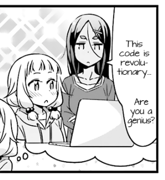

## Thank you so much!

Daryll Ko ("Daryll")

- [Facebook](https://www.facebook.com/daryll.ko.3)

- Discord: `_daryll_`

- [GitHub](https://github.com/daryll-ko)

- Email: `dlko` @ `up.edu.ph`

- [personal site](https://daryll.vercel.app/)

I currently go by these profile pics, if you want to verify it's me:

Link to these slides:

<a href="bootcamp-oop.vercel.app">bootcamp-oop.vercel.app</a>

