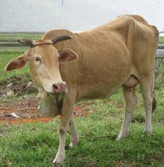

## Polymorphism

<v-click>

A symbol may mean different things in different contexts!

</v-click>

<v-clicks>

_baka_, "cow" in Tagalog

バカ _(baka)_, "stupid" in Japanese

</v-clicks>

<v-click>

In Python, `+` means addition for numbers but concatenation for strings!

</v-click>
